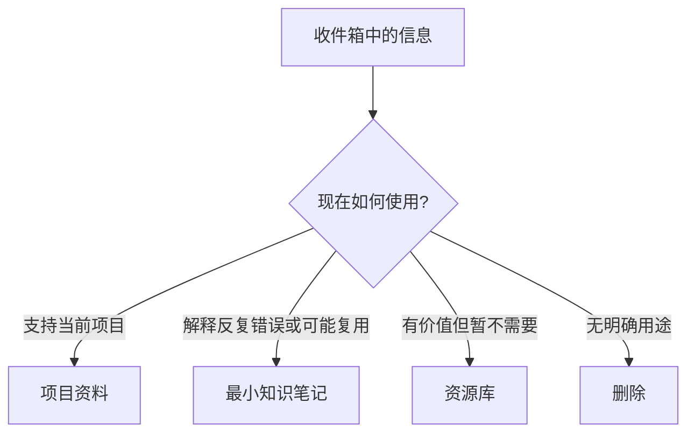

> 本 SOP 按需使用，不是第二个日常入口。需要学习、解决问题或整理收件箱时再打开；收件箱可在当前面板安排的时间批量处理。

## 一、先行动，再记录

遇到一个需要学习或解决的问题时，只走五步：

1. 定一个可验证的问题或成果。
2. 不看答案，先回忆、解题或实现。
3. 根据卡点定向查官方文档、教材或源码。
4. 回到原题或项目中验证结果。
5. 只写一条以后会复用的最小笔记。

视频仅用于快速了解架构概览，或帮助突破卡住的概念，不是默认学习路径。

遇到完全陌生的概念或领域、需要系统学透时，改用 [AI辅助概念深度学习法](/blog/posts/ai-assisted-deep-learning/) 的问答闭环拆解；学完仍按本 SOP 第三节沉淀最小笔记，两套不并行执行。

## 二、信息路由

处理收件箱时，逐条判断并直接路由：

| 判断 | 去向 |
|------|------|
| 能直接支持当前项目 | 优先移入 `02-项目管理/[项目名]/参考资料/`，并尽快在项目中使用；实际验证后，只有结论可跨项目复用时才另写最小知识笔记，并链接原资料，避免重复保存 |
| 能解释反复出现的错误，或以后可能复用 | 按最小格式写入 `04-知识笔记/` |
| 是有价值的工具、链接或资料，但现在不需要学习 | 移入 `05-资源库/` |
| 不完整、无明确用途，或只是“以后再看” | 删除 |

只有在信息支持当前项目、解释反复错误或可能复用时，才写知识笔记。收藏本身不等于学习，也不要求把所有信息转成笔记。



## 三、最小笔记

笔记只保留四个必填字段：

```markdown
# 标题

- 一句话理解：
- 一个例子或题型：
- 一个易错点：
- 来源：
```

用自己的话写，例子优先来自刚完成的题目或项目验证。标签和反向链接可选；想得到时再补，不阻断记录和使用。

## 四、主动回忆与复习触发

- 考试关键知识或反复出错的知识：次日主动回忆并复习一次。
- 写下考试关键知识或反复出错笔记时：立即在当前面板或日历创建一次性次日提醒；完成复习后删除提醒，不建立常驻复习队列。
- 项目或新题再次需要某条知识：先回忆，再打开笔记核对，并回到任务中验证。
- 普通收藏和暂未使用的资料：不安排复习。

复习的目标是再次解决问题，不是维护收藏数量或制造完整的知识图谱。

## 五、快速检查

写笔记前问：

1. 它是否支持当前项目？
2. 它是否解释了我反复出现的错误？
3. 它是否很可能再次使用？

三个答案都为“否”，就不写知识笔记。需要整理收件箱时，可直接在当前面板安排一次批量处理；没有待解决的问题时，不必进入本 SOP。

> 知识笔记的价值在于再次被调用，并帮助完成题目或项目。
